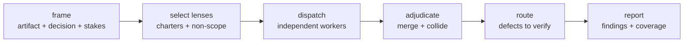

# deep-review

!!! abstract "Multi-lens evaluative review with preserved disagreement"
    Reads one artifact — a diff, design, plan, or document — through independent
    charters and reports what will go wrong. Retrieval finds material,
    [`verify`](verify.md) settles whether a claim is true, and
    [`corpus-review`](corpus-review.md) proves everything was read. This plugin
    answers the remaining question: *is this good?*

`deep-review` declares `dependencies: ["plan-execute", "verify"]`. It reuses
[`plan-execute`](plan-execute.md)'s cheap-worker fan-out to run lenses in
parallel, and routes every checkable finding to [`verify`](verify.md) rather
than grading its own defects. `verify` already pulls the
[retrieval spine](retrieval-core.md).

## Install

=== "GitHub Copilot"

    ```bash
    copilot plugin marketplace add mbeacom/context-kit
    copilot plugin install deep-review@context-kit
    ```

=== "APM"

    ```bash
    apm marketplace add mbeacom/context-kit
    apm install deep-review@context-kit   # also deploys plan-execute and verify
    ```

=== "Claude Code"

    ```bash
    /plugin marketplace add mbeacom/context-kit
    /plugin install deep-review@context-kit
    ```

## Components

| Component | What it is |
| --- | --- |
| **`deep-review`** skill | The frame → lenses → dispatch → adjudicate → route → report pipeline, the finding taxonomy, and the rules that keep a panel honest. |
| **`review-lens`** subagent | Reviews one artifact through one assigned charter and returns typed, cited findings plus its own coverage. Read-only and charter-scoped. |
| **`/deep-review`** command | Runs the panel end to end over an artifact. |
| **`adjudicate-findings.py`** | Validates the contract, merges corroboration, flags tradeoff candidates, and emits the review ledger. |

One worker parameterized by a charter, not one agent per persona. A fixed roster
would hardcode which perspectives exist; a charter is data, so a domain lens
(security, accessibility, privacy, cost) needs no new component.

## Judgment is not verification

| | Verification | Corpus review | Deep review |
| --- | --- | --- | --- |
| Question | is this claim true? | did we read all of it? | is this good? |
| Output | a verdict per claim | a disposition per unit | a typed finding per concern |
| Evidence | `file:line` | inspected units | the artifact plus its context |
| Disagreement | not applicable | not applicable | preserved as a tradeoff |

A `DEFECT` finding is a *hypothesis*, not a verdict. It becomes a claim for
[`verify`](verify.md); reporting it as confirmed before that verdict returns is
the overreach this plugin exists to prevent.

## Why a panel needs machinery

An unstructured multi-perspective review degrades in three predictable ways:

- **Volume as rigor** — more findings read as more diligence, so reviewers pad.
- **Manufactured disagreement** — distinct personas invent distinct objections
  even when they agree, and one issue is counted three times.
- **Preference laundering** — a style opinion is phrased as a defect, and the
  author cannot tell what they are allowed to decline.

Each rule below blocks one of them.

## Finding types

Every finding declares exactly one type, and the type decides how it is settled:

| Type | Meaning | Required fields | Settled by |
| --- | --- | --- | --- |
| `DEFECT` | a checkable assertion that the artifact is wrong | + `Falsification` | `verify` |
| `RISK` | a conditional prediction | + `Trigger` | triage: judgment, or `runtime-evidence` when the trigger is observable |
| `JUDGMENT` | a tradeoff with no fact of the matter | — | the author, who may decline |
| `QUESTION` | the reviewer lacks context | — | an answer, not a fix |

A `DEFECT` you cannot exhibit is a `RISK`; a `RISK` with no trigger is a
`JUDGMENT`. Adjudication enforces this by rejecting a report that omits the
required field, so "falsify or downgrade" is structural rather than advisory.

## Default lenses

| Lens | Responsible for | Silent about |
| --- | --- | --- |
| `adversarial` | making it fail: edge cases, error paths, concurrency, trust boundaries | style, structure, docs, design direction |
| `architect` | coherence with the existing system, coupling, precedent, evolution cost | bug hunting, runtime failure modes, tooling |
| `consumer` | the artifact in use: API shape, defaults, error messages, migration burden | internals, implementation quality, deployment |
| `operator` | day two: detectability, diagnosability, reversibility, on-call burden | elegance, API taste, code style |

The **silent about** column is load-bearing. Without an explicit non-scope, four
lenses all file the same naming complaint and the panel becomes an echo.

## Pipeline



```bash
ROOT="${CONTEXT_KIT_DEEP_REVIEW_ROOT:-plugins/deep-review}"

# frame.json declares artifact, decision, stakes, and expected_lenses;
# dispatch one review-lens worker per charter -> ./work/findings/<lens>.md

python3 "$ROOT/scripts/adjudicate-findings.py" \
  --frame ./work/frame.json \
  --findings-dir ./work/findings \
  --out-dir ./work/report
```

Claude Code components may use `CLAUDE_PLUGIN_ROOT` as the plugin-root fallback.

## Adjudication

**Corroboration merges, never multiplies.** Findings sharing a type, a citation,
and a similar problem collapse into one entry carrying every lens that raised it
and the highest severity any of them asserted. Counting agreement three times
would destroy the exact signal independent lenses exist to produce.

That signal is only meaningful because **no lens ever sees another's findings**.
A panel run with shared visibility produces agreement that means nothing.

**Disagreement is preserved.** Two lenses at one citation whose resolutions are
dissimilar surface as a *tradeoff candidate* routed to whoever owns the
decision. Every lens's own resolution is kept on the merged entry and conflict
detection runs over those positions, so two lenses that agree on the problem
but want opposite fixes still collide — merging a problem never merges away a
fix. These are candidates, not proven contradictions — deciding whether two
prose resolutions genuinely conflict is not a deterministic operation, and the
script does not pretend otherwise. The value is surfacing the collision instead
of letting a synthesizer quietly pick a winner.

!!! warning "A missing lens is not a clean lens"
    The frame's `expected_lenses` roster is required. A declared lens with no
    report exits nonzero and appears under **Degraded review**. Without a
    roster, a crashed worker is indistinguishable from one that found nothing —
    and a failed operator lens would read as an operable artifact.

## Reading the ledger honestly

- **A clean ledger is not an approval.** It reports what the declared lenses
  looked at; coverage gaps bound what silence means.
- **Counts are not quality.** Ten `note` findings and one `blocking` finding is
  not eleven problems.
- **Unrouted defects are unfinished work.** A `DEFECT` that has not been through
  `verify` is still a hypothesis.

## Composition

- [`verify`](verify.md) — owns truth; every `DEFECT` becomes a claim there.
- [`plan-execute`](plan-execute.md) — cheap lens workers, strong synthesizer.
- [`runtime-evidence`](runtime-evidence.md) — settles an observable `RISK`.
- [`corpus-review`](corpus-review.md) — shard an oversized artifact first, then
  review the shards; coverage and judgment compose.
- [`memory`](memory.md) — recalls settled constraints so the panel does not
  relitigate a closed tradeoff, and captures the ones this review closes.
- [`code-search`](code-search.md) — lenses need callers, precedent, and history
  beyond the diff.

## Development

```bash
python3 -m unittest discover -s plugins/deep-review/tests -p 'test_*.py'
```

Hermetic: no network, no model, temporary directories only.
