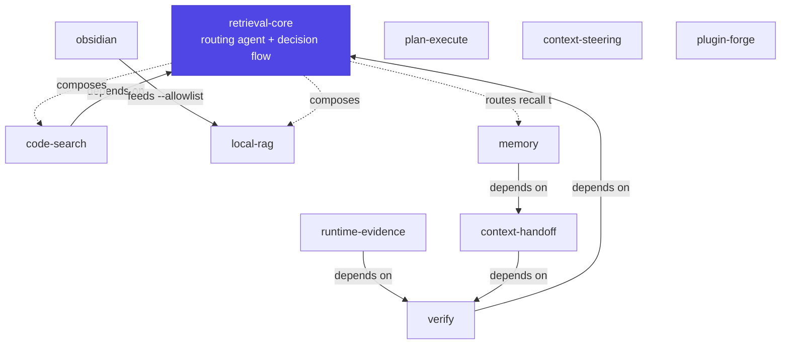

# Plugins

The marketplace ships eleven plugins. The **spine** is retrieval — a routing
agent that picks and composes modalities — surrounded by plugins for
orchestration, steering, verification and impact analysis, controlled runtime
evidence, cross-session handoff, and authoring.

-   :material-map-search-outline:{ .lg .middle } **[retrieval-core](retrieval-core.md)**

    ---

    The spine: a `retrieval-strategist` agent + `retrieval-strategy` skill that
    choose and compose modalities. Other plugins depend on it.

    `retrieval` · shipped

-   :material-magnify:{ .lg .middle } **[code-search](code-search.md)**

    ---

    Lexical, structural, code-intelligence, structured-data, history, rewrite,
    metrics, and non-code doc search. Two skills split by corpus.

    `retrieval` · shipped

-   :material-database-search:{ .lg .middle } **[local-rag](local-rag.md)**

    ---

    Fully-local semantic RAG: a `bin/rag` CLI with turbovec vectors, opt-in
    FTS5/BM25 reciprocal-rank fusion, and hybrid `--allowlist` retrieval.

    `retrieval` · shipped

-   :material-notebook-outline:{ .lg .middle } **[obsidian](obsidian.md)**

    ---

    Skill-only RAG bridge: turn a vault's graph and tags into a candidate set
    fed to `local-rag`.

    `retrieval` · shipped

-   :material-scale-balance:{ .lg .middle } **[plan-execute](plan-execute.md)**

    ---

    Plan-big / execute-small orchestration: a strong model plans and delegates
    token-heavy work to a cheaper executor.

    `orchestration` · shipped

-   :material-tune-variant:{ .lg .middle } **[context-steering](context-steering.md)**

    ---

    Place guidance at the cheapest layer that still fires — memory, rules,
    skills, subagents, MCP servers, or hooks.

    `steering` · shipped

-   :material-check-decagram-outline:{ .lg .middle } **[verify](verify.md)**

    ---

    Read-only per-claim verification plus prospective change-impact and
    blast-radius analysis.

    `verification` · shipped

-   :material-pulse:{ .lg .middle } **[runtime-evidence](runtime-evidence.md)**

    ---

    Controlled runtime observation after static verification cannot settle a
    claim, using exact allowlisted command IDs and bounded artifacts.

    `verification` · shipped

-   :material-swap-horizontal:{ .lg .middle } **[context-handoff](context-handoff.md)**

    ---

    Manual-first, bounded task-state handoffs with a read-only compiler and
    deterministic provenance/freshness validation.

    `continuity` · shipped

-   :material-head-cog-outline:{ .lg .middle } **[memory](memory.md)**

    ---

    Reviewed durable memories with provenance, cue anchors, freshness,
    supersession, and an optional project-isolated MemPalace provider.

    `continuity` · shipped

-   :material-hammer-wrench:{ .lg .middle } **[plugin-forge](plugin-forge.md)**

    ---

    Author portable plugins with scaffolding, manifest/frontmatter checks, and a
    deterministic aggregate catalog discovery-quality gate.

    `authoring` · shipped

## How they fit together

- **`code-search`** and **`verify`** depend on `retrieval-core`.
- **`runtime-evidence`** and **`context-handoff`** depend on `verify`, so
  installing either transitively pulls the spine.
- **`memory`** depends on `context-handoff`, so it also pulls `verify` and the
  retrieval spine. Handoffs remain authoritative current task state; archived
  copies are historical evidence.
- **`obsidian`** and **`local-rag`** pair: the bridge produces candidate note
  paths that feed `local-rag`'s hybrid `--allowlist` search.
- **`plan-execute`**, **`context-steering`**, and **`plugin-forge`** are
  independent — orchestration, steering, and authoring around the retrieval core.
  `verify` can optionally use `plan-execute` for broad read-only impact coverage,
  but does not depend on it.

## Dependencies at a glance

| Plugin | Category | Ships | Depends on |
| --- | --- | --- | --- |
| [retrieval-core](retrieval-core.md) | retrieval | agent + skill | — |
| [code-search](code-search.md) | retrieval | 2 skills + tool checker | `retrieval-core` |
| [local-rag](local-rag.md) | retrieval | `bin/rag` CLI + skill | ollama + turbovec + SQLite FTS5 for `--hybrid` |
| [obsidian](obsidian.md) | retrieval | skill only | `local-rag` (runtime) |
| [plan-execute](plan-execute.md) | orchestration | skill + command + workflow + subagent | — |
| [context-steering](context-steering.md) | steering | skill + examples | — |
| [verify](verify.md) | verification | subagent + 2 skills + command | `retrieval-core` |
| [runtime-evidence](runtime-evidence.md) | verification | skill + command + subagent + stdlib runner | `verify` → `retrieval-core` |
| [context-handoff](context-handoff.md) | continuity | skill + 2 commands + subagent + stdlib validator | `verify` → `retrieval-core` |
| [memory](memory.md) | continuity | skill + 4 commands + stdlib adapter + opt-in Claude hooks | `context-handoff` → `verify` → `retrieval-core`; MemPalace optional |
| [plugin-forge](plugin-forge.md) | authoring | skill + command + validators/tests | — |
