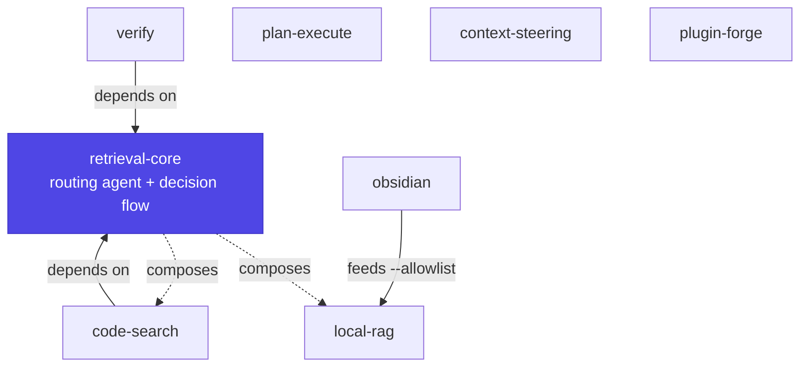

# Plugins

The marketplace ships eight plugins. The **spine** is retrieval — a routing
agent that picks and composes modalities — surrounded by plugins for
orchestration, steering, verification, and authoring.

-   :material-map-search-outline:{ .lg .middle } **[retrieval-core](retrieval-core.md)**

    ---

    The spine: a `retrieval-strategist` agent + `retrieval-strategy` skill that
    choose and compose modalities. Other plugins depend on it.

    `retrieval` · shipped

-   :material-magnify:{ .lg .middle } **[code-search](code-search.md)**

    ---

    Lexical, structural, structured-data, history, rewrite, metrics, and
    non-code doc search. Two skills split by corpus.

    `retrieval` · shipped

-   :material-database-search:{ .lg .middle } **[local-rag](local-rag.md)**

    ---

    Fully-local semantic RAG: a `bin/rag` CLI that chunks, embeds via ollama,
    and indexes with turbovec. Hybrid `--allowlist` retrieval.

    `retrieval` · shipped

-   :material-notebook-outline:{ .lg .middle } **[obsidian](obsidian.md)**

    ---

    Skill-only RAG bridge: turn a vault's graph and tags into a candidate set
    fed to `local-rag`.

    `retrieval` · shipped

-   :material-scale-balance:{ .lg .middle } **[plan-execute](plan-execute.md)**

    ---

    Plan-big / execute-small orchestration: a strong model plans and delegates
    token-heavy work to a cheaper executor.

    `orchestration` · shipped

-   :material-tune-variant:{ .lg .middle } **[context-steering](context-steering.md)**

    ---

    Place guidance at the cheapest layer that still fires — memory, rules,
    skills, subagents, or hooks.

    `steering` · shipped

-   :material-check-decagram-outline:{ .lg .middle } **[verify](verify.md)**

    ---

    Read-only `verifier` subagent + `verify-before-trust` skill; per-claim
    verdicts with `file:line` evidence.

    `verification` · shipped

-   :material-hammer-wrench:{ .lg .middle } **[plugin-forge](plugin-forge.md)**

    ---

    Author portable plugins and keep `plugin.json` ⇆ `apm.yml` in sync: a
    conventions skill, `/scaffold-plugin`, and a drift validator.

    `authoring` · shipped

## How they fit together

- **`code-search`** and **`verify`** declare `dependencies: ["retrieval-core"]`,
  so installing either pulls the spine.
- **`obsidian`** and **`local-rag`** pair: the bridge produces candidate note
  paths that feed `local-rag`'s hybrid `--allowlist` search.
- **`plan-execute`**, **`context-steering`**, and **`plugin-forge`** are
  independent — orchestration, steering, and authoring around the retrieval core.

## Dependencies at a glance

| Plugin | Category | Ships | Depends on |
| --- | --- | --- | --- |
| [retrieval-core](retrieval-core.md) | retrieval | agent + skill | — |
| [code-search](code-search.md) | retrieval | 2 skills + tool checker | `retrieval-core` |
| [local-rag](local-rag.md) | retrieval | `bin/rag` CLI + skill | ollama + turbovec |
| [obsidian](obsidian.md) | retrieval | skill only | `local-rag` (runtime) |
| [plan-execute](plan-execute.md) | orchestration | skill + command + workflow + subagent | — |
| [context-steering](context-steering.md) | steering | skill + examples | — |
| [verify](verify.md) | verification | subagent + skill | `retrieval-core` |
| [plugin-forge](plugin-forge.md) | authoring | skill + command + validator | — |
